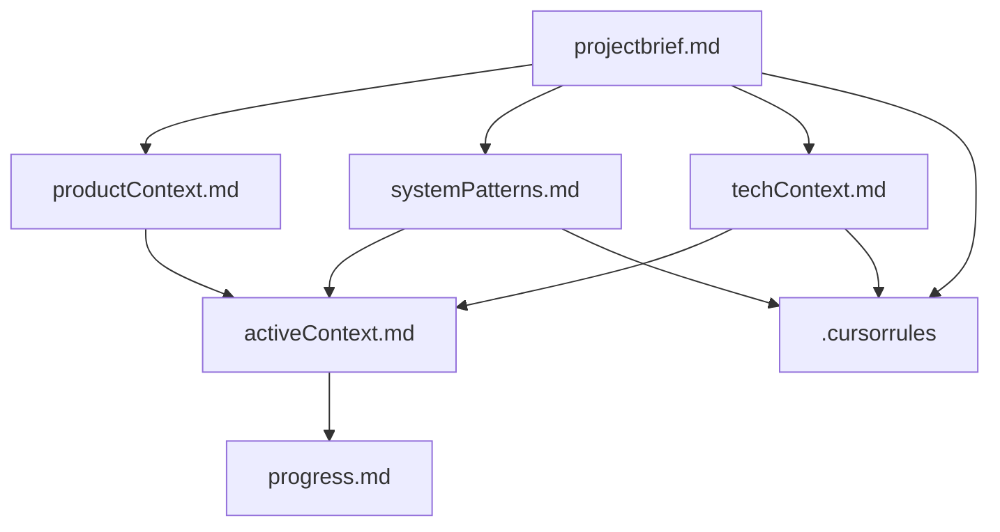

# Memory Bank: Bot de Confirmaciones RedSalud

## Descripción

Este Memory Bank contiene toda la documentación y contexto del proyecto de bot de confirmaciones para RedSalud. Está diseñado para mantener el conocimiento del proyecto entre sesiones de desarrollo.

## Estructura del Memory Bank

### Archivos Core (Requeridos)

1. **`projectbrief.md`** - Documento fundacional
   - Objetivo principal del proyecto
   - Alcance y funcionalidades
   - Tecnologías utilizadas
   - Estado actual

2. **`productContext.md`** - Contexto del producto
   - Problemas que resuelve
   - Experiencia de usuario
   - Integración con RedSalud
   - Métricas de éxito

3. **`systemPatterns.md`** - Arquitectura del sistema
   - Patrones de diseño implementados
   - Estructura de archivos
   - Flujos de conversación
   - Integración API

4. **`techContext.md`** - Contexto técnico
   - Stack tecnológico
   - Configuración del entorno
   - Intents y entities
   - Acciones personalizadas

5. **`activeContext.md`** - Contexto activo
   - Estado actual del trabajo
   - Decisiones técnicas activas
   - Próximos pasos
   - Problemas resueltos

6. **`progress.md`** - Progreso del proyecto
   - Funcionalidades completadas
   - Trabajo en progreso
   - Pendiente por implementar
   - Métricas de calidad

### Archivos de Documentación Especializada

7. **`databaseSchema.md`** - Esquema de base de datos
   - Estructura de la tabla `appointments`
   - Mapeo de campos con slots del bot
   - Operaciones de base de datos
   - Consideraciones de diseño

### Archivo de Configuración

- **`.cursorrules`** - Reglas y patrones del proyecto
  - Convenciones de naming
  - Patrones de código
  - Comandos útiles
  - Soluciones a problemas comunes

## Cómo Usar el Memory Bank

### Para Nuevas Sesiones
1. Leer `projectbrief.md` para entender el objetivo
2. Revisar `activeContext.md` para el estado actual
3. Consultar `progress.md` para ver qué falta
4. Usar `.cursorrules` para patrones del proyecto

### Para Actualizaciones
1. Actualizar `activeContext.md` con cambios recientes
2. Modificar `progress.md` según avances
3. Documentar nuevas decisiones en `systemPatterns.md`
4. Actualizar `.cursorrules` con nuevos patrones

### Para Planificación
1. Revisar `productContext.md` para objetivos
2. Consultar `techContext.md` para limitaciones
3. Usar `systemPatterns.md` para arquitectura
4. Planificar basado en `progress.md`

## Jerarquía de Información



## Comandos Útiles

### Validación del Setup
```bash
python validate_setup.py
```

### Entrenamiento del Modelo
```bash
rasa train
```

### Servidor de Acciones
```bash
rasa run actions
```

### Chat Interactivo
```bash
rasa shell
```

## Estado del Proyecto

**Progreso General: 85% Completado**

### ✅ Completado
- Configuración base del proyecto
- Integración con API de RedSalud/Apigee
- Sistema de confirmación y cancelación de citas
- Manejo de errores y fallback
- Formateo de fechas en español
- Variables de entorno configuradas

### 🔄 En Progreso
- Pruebas de integración
- Optimización de respuestas

### 📋 Próximos Pasos
1. Entrenar modelo con configuración actual
2. Probar flujos de confirmación y cancelación
3. Validar integración con API de RedSalud
4. Optimizar respuestas y manejo de errores

## Contacto

Para preguntas sobre el proyecto o el Memory Bank, consultar la documentación técnica en los archivos correspondientes o revisar el contexto activo en `activeContext.md`. 